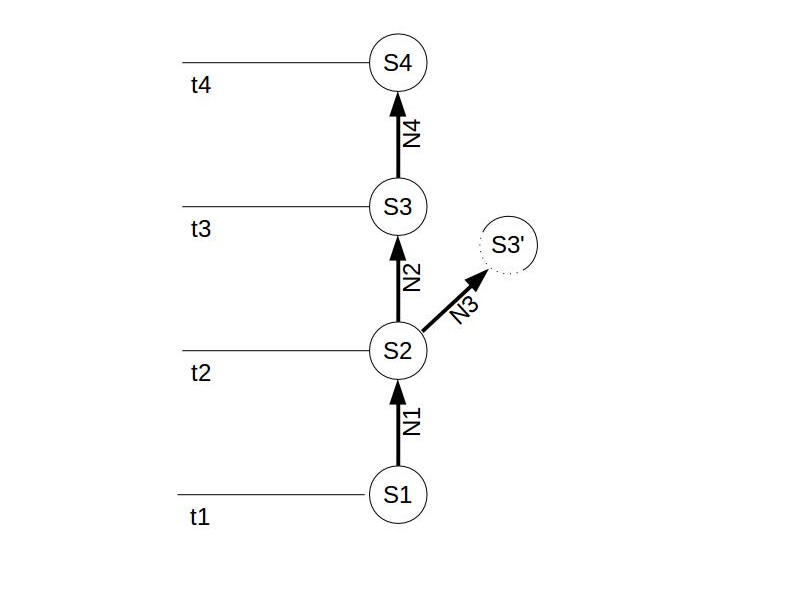
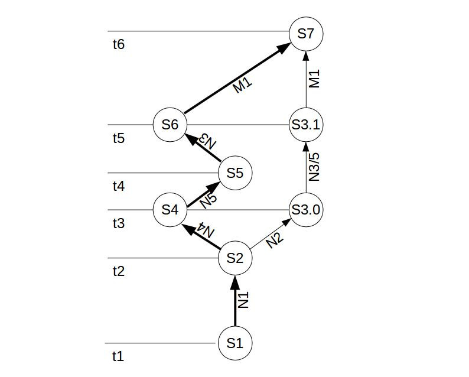
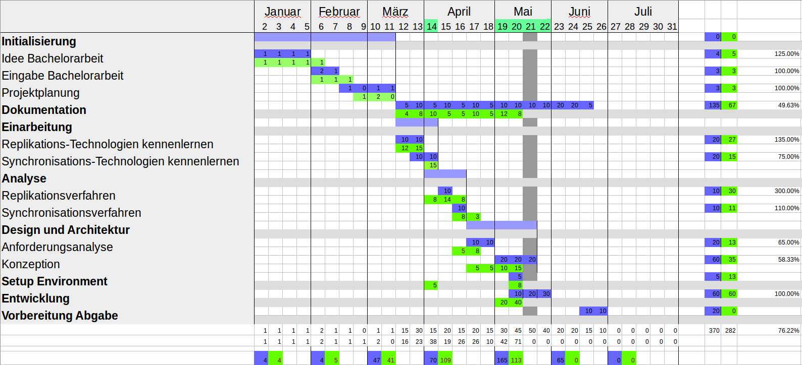

<!--
-Stand, wesentliche Aspekte
-Diskussion des gewählten Konzepts
-Offene Punkte
-Anpassung Aufgabenstellung
-Restplanung
-->

#

## Aufgabenstellung
_Mobile Applikationen (Ressourcen-Planung, Ausleihlisten, etc.) gleichen lokale Daten mit dem Server ab. Manchmal werden von mehreren Applikationen, gleichzeitig, dieselben Datensätze mutiert. Dies kann zu Konflikten führen. Welche **Techniken und Lösungswege** können angewendet werden, **damit Konflikte** gelöst werden können oder gar **nicht** erst **auftreten**?_

<aside class="notes">
</aside>

## server not found!

<aside class="notes">
Gewöhnung an den Zustand des "immer online seins" - was passiert wenn mal kein Empfang?
</aside>

# Konzepte

## 

##

# Sync Verfahren

## Konfliktvermeidung
- Update Transformation
- Wiederholbare Transaktion

## Konfliktauflösung
- Zusammenführung
- normalisierte Zusammenführung
- gewichtete Zusammenführung

#

## Stand 1
- Recherche [ok]
- Diskussion & Analyse [ok]
- Lösungsansätze suchen [ok]
- Prototyp Implementieren [nc]
- Dokumentation [nc]

## Architektur
- nur Clients
- Server - dumme Clients
- Clients - Server <--

## Architektur 

## Stack
- fluxifyJS
- reactJS
- nodeJS
- RequireJS
- express
- socket.io
- sequelize
- karma
- CoffeeScript

## TDD

## TDD

## persönliche Ziele
- Ist-Zustand verstehen [ok]
- Verbesserungsmöglichkeiten aufzeigen [pending]

## Planung

## Nächste Schritte
- Dokumentation vervollständigen
- Prototyp Präsentations-fertig

## Termine
- Endscheid über Abschluss: 6. Juni
- Abschluss: Ende Juni oder Mitte August

## Es gibt noch Luft

# 

##Aufgabenstellung 1/2
- A/R1
    + Glossar [pending]
    + Bestehendes [ok]
- A/R2: 
    + Sync MySQL,MonboDB [ok]
    + BackboneJS, MeteorJS [ok]
    + Anforderungsanalyse [nc]
- A/R3
    + Erstellen Konzept Software [nok]
    + Erstellen Konzept Sync [nok]

##Aufgabenstellung 2/2
- A/R4
    + Konzeption Prototyp [ok]
    + Entwickeln Prototyp [ok]
- A/R5
    + Test des Prototypen [nok]

##Anpassungen
- Ziel der Arbeit: "Konzeption und __beispielhafte Implementierung__ eines __!__ Software-Prototypen, welcher ... "

- Aufgabenstellung A3:
    + Erstellen des Konzepts zur __Synchronisation__
- Erwartete Resultate R3:
    + Dokumentation des Konzepts zur __Synchronisation__

## Offene Punkte
- Experte?

## Fragen

