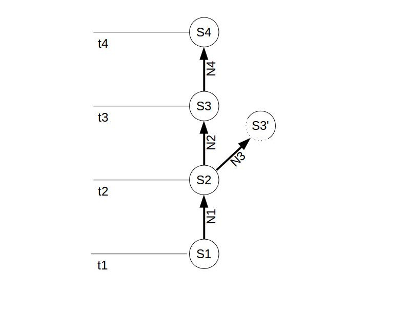

<!--
-Stand, wesentliche Aspekte
-Diskussion des gewählten Konzepts
-Offene Punkte
-Anpassung Aufgabenstellung
-Restplanung
-->

#

## Aufgabenstellung
_Mobile Applikationen (Ressourcen-Planung, Ausleihlisten, etc.) gleichen lokale Daten mit dem Server ab. Manchmal werden von mehreren Applikationen, gleichzeitig, dieselben Datensätze mutiert. Dies kann zu Konflikten führen. Welche **Techniken und Lösungswege** können angewendet werden, **damit Konflikte** gelöst werden können oder gar **nicht** erst **auftreten**?_

<aside class="notes">
</aside>

## server not found!

<aside class="notes">
Gewöhnung an den Zustand des "immer online seins" - was passiert wenn mal kein Empfang?
</aside>

# Konzepte

## Single State

## Multi State

# Sync Verfahren

## Konfliktvermeidung
- Update Transformation
- Wiederholbare Transaktion

## Konfliktauflösung
- Zusammenführung
- normalisierte Zusammenführung
- gewichtete Zusammenführung

## Stand
- Recherche [ok]
- Diskussion & Analyse [ok]
- Lösungsansätze suchen [ok]
- Prototyp Implementieren [pending]
- Dokumentation [pending]

## persönliche Ziele
- Ist-Zustand verstehen [ok]
- Verbesserungsmöglichkeiten aufzeigen [pending]

## Planung

## Nächste Schritte
- Dokumentation vervollständigen
- Prototyp Präsentations-fertig

## Termine
- Endscheid über Abschluss: 6. Juni
- Abschluss: Ende Juni oder Mitte August

# 

##Aufgabenstellung
- A/R1
    + Glossar [pending]
    + Bestehendes [nc]
- A/R2: 
    + Sync MySQL,MonboDB [nc]
    + BackboneJS, MeteorJS [nc]
    + Anforderungsanalyse [nc]
- A/R3
    + Erstellen Konzept Software [nok]
    + Erstellen Konzept Sync [nok]
- A/R4
    + Konzeption Prototyp [ok]
    + Entwickeln Prototyp [ok]
- A/R5
    + Test des Prototypen [nok]

##Anpassungen
- Ziel der Arbeit: "Konzeption und __beispielhafte Implementierung__ eines __!__ Software-Prototypen, welcher ... "

- Aufgabenstellung A3:
    + Erstellen des Konzepts zur __Synchronisation__
- Erwartete Resultate R3_
    + Dokumentation des Konzepts zur __Synchronisation__

## Fragen