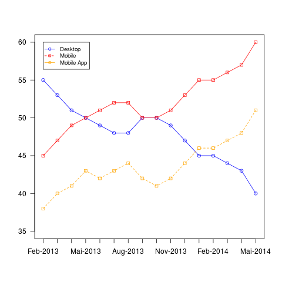
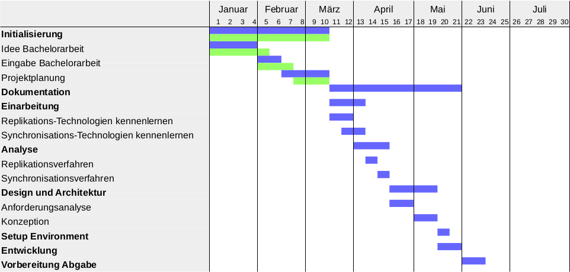

## Aufgabenstellung
<!-- Wichtigstes hervorheben? -->
_Mobile Applikationen (Ressourcen-Planung, Ausleihlisten, etc.) gleichen lokale Daten mit dem Server ab. Manchmal werden von mehreren Applikationen, gleichzeitig, dieselben Datensätze mutiert. Dies kann zu Konflikten führen. Welche **Techniken und Lösungswege** können angewendet werden, **damit Konflikte** gelöst werden können oder gar **nicht** erst **auftreten**?_

<aside class="notes">
Verstehen und Einordnen des Probleme. Finden von Lösungsansätzen etc.

Verzögerungen im Netzwerk, gleichzeitiger Zugriff etc.
</aside>

## Aufgabenstellung

<aside class="notes">
Quelle: Comescore
US-Markt - Keine öffentlichen Angaben zum CH Markt.
</aside>

## server not found!

<aside class="notes">
Gewöhnung an den Zustand des "immer online seins" - was passiert wenn mal kein Empfang?
</aside>

## Trends
"It's clear that the mobile industry has finally given up on the fantasy that an Internet connection is available to all users at all times..." [Mike Elgan]

<aside class="notes">
Job: journalist, blogger, columnist and podcaster

wrote for: Computerworld, Cult of Android, Cult of Mac, Forbes, Datamation, eWeek and Baseline

was chief editor for the technology publication Windows Magazine

quoted by: The New York Times, Wall Street JournalBBC, CNN, FOX News, and NPR.
</aside>

## Beispiel
>- Elektrozähler
>- Facebook
>- 20-Min
>- Ressourcenverwaltung

<aside class="notes">
Elektrozähler: Ablesen der Stände -> www

Facebook: "Offline posting"

20-Min: prefetch

Ressourcenverwaltung: Raumreservierung etc.
</aside>

# Erw. Resultate
- Analyse Synchronisationsverfahren
- Analyse Konfliktlösungsverfahren
- Ausarbeitung zweier offline Synch.verfahren
- Prototyp

# 

## persönliche Ziele
- Ist-Zustand verstehen
- Verbesserungsmöglichkeiten aufzeigen

#  

## Vorgehensweise
- Recherche
- Diskussion & Analyse
- Lösungsansätze suchen
- Prototyp implementieren

## Grobplanung

<aside class="notes">
Nebenläufig:

- IPA bis Ende März

- Sem Mobile Netzwerke bis Ende Juni

- Sem XML-Datenbanken bis Ende Juni

- Projekt Scrum Board bis Mitte April

Ferien: 1. April Woche

Unterrichtsfreie Zeit: ...
</aside>

## Termine

- Design Review ~ Mitte April
- Abschluss ~ Anfangs Juni

#

## Fragen